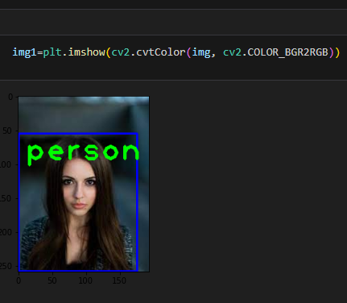

# Real-Time Object Detection and Identification

This project implements a **real-time object detection system** using **SSD MobileNet v3** and **OpenCV’s DNN module**.  
It supports object detection from **images, videos, and live webcam streams** using a **pre-trained COCO dataset**.

---

## 📌 Project Description
Object detection is a core computer vision task widely used in surveillance, autonomous vehicles, and smart systems.  
This project uses a **Single Shot Detector (SSD)** with **MobileNet v3** backbone to achieve fast and efficient real-time detection.

---

## 📁 Project Structure

```
Real-Time-Object-Detection-and-Identification/
│
├── object_detection.py        # Main Python script for object detection
│
├── models/                    # Pre-trained model files
│   ├── frozen_inference_graph.pb
│   └── ssd_mobilenet_v3_large_coco_2020_01_14.pbtxt
│
├── labels/                    # Class label definitions
│   └── Labels.txt
│
├── data/                      # Input data for testing
│   ├── images/
│   │   └── sample_image.jpg
│   └── videos/
│       └── sample_video.mp4
│
├── screenshots/               # Output screenshots
│   ├── image_output.png
│   ├── video_output.png
│   └── webcam_output.png
│
├── requirements.txt           # Python dependencies
├── README.md                  # Project documentation
├── .gitignore                 # Ignored files and folders
└── LICENSE                    # Project license (MIT)
```

---

## 🚀 Features
- Real-time object detection
- Image, video, and webcam input support
- Bounding boxes with object labels
- Lightweight and fast inference
- Uses pre-trained COCO dataset

---

## 🛠 Tech Stack
- Python
- OpenCV (DNN module)
- SSD MobileNet v3
- COCO Dataset

---

## ▶️ How to Run

```bash
pip install -r requirements.txt
python object_detection.py
```

Press **`q`** to exit video or webcam detection.

---

## 📸 Output Screenshots

### Image Detection


### Video Detection
(Screenshot will be added soon)

### Webcam Detection
(Screenshot will be added soon)


---

## 🧠 Model Details
- **Model:** SSD MobileNet v3
- **Dataset:** COCO (80 object classes)
- **Input Size:** 320 × 320
- **Inference Engine:** OpenCV DNN

---

## ⚠️ Limitations
- Uses pre-trained model only
- Cannot detect custom object classes
- Performance depends on lighting and camera quality

---

## 🔮 Future Enhancements
- Custom dataset training
- YOLO-based detection
- FPS optimization
- GUI-based interface (Streamlit/Tkinter)
- Web deployment

---

## 📜 License
This project is licensed under the **MIT License**.

---

## 👨‍💻 Author
**Subhrajit Baral**  
🔗 GitHub: https://github.com/SubhrajitBaral123
